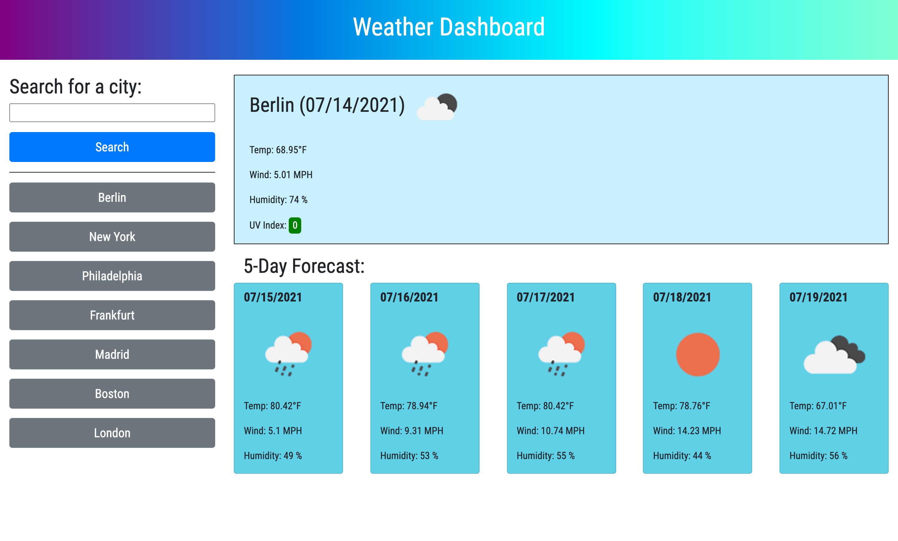

# Weather Dashboard

## Providing weather forecasts

* The live [web application](https://jeffmullen.github.io/weather-dashboard/).

## Functionality

* This application provides weather data for a searched city.

    * Data is displayed on the page with dynamic JavaScript and jQuery.

* Uses OpenWeatherAPI to fetch request data.

    * Various query parameters used to retrieve data.

    * Weather icons come from the API.

* Previously searched cities stored beneath the search bar.

    * Clicking on a city brings up corresponding weather data.

## Webpage

